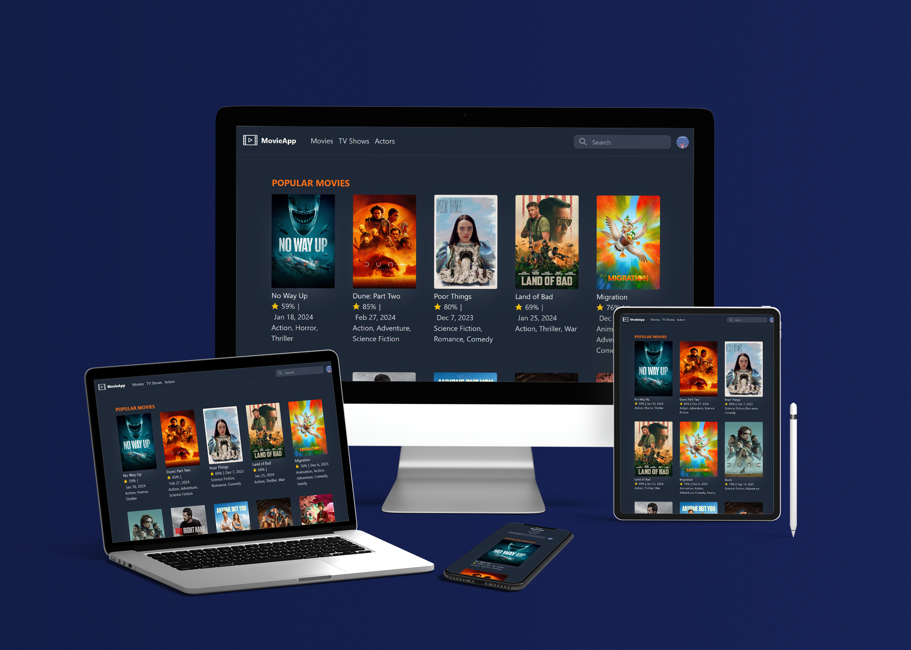

---

# Laravel TMDB Project

This project is a Laravel application that utilizes the TMDB (The Movie Database) API to fetch movie data.

## Installation

To get started with this project, follow these steps:

1. **Clone the repository**

   ```bash
   git clone https://github.com/Teon54/moives_api_laravel.git
   ```

2. **Install dependencies**

   Navigate into your project directory and run:

   ```bash
   composer install
   npm install && npm run dev
   ```

3. **Set up environment variables**

   Copy the `.env.example` file to `.env`:

   ```bash
   cp .env.example .env
   ```

   Update the `.env` file with your database and TMDB API credentials:

   ```plaintext
   APP_NAME=Laravel
   APP_ENV=local
   APP_KEY=your-app-key
   APP_DEBUG=true
   APP_URL=http://localhost

   ...

   DB_CONNECTION=mysql
   DB_HOST=127.0.0.1
   DB_PORT=3306
   DB_DATABASE=movie_example
   DB_USERNAME=root
   DB_PASSWORD=your-db-password

   ...

   TMDB_TOKEN=your-tmdb-api-token
   ```

4. **Generate application key**

   Run the following command to generate a new application key:

   ```bash
   php artisan key:generate
   ```

5. **Run migrations**

   Run the database migrations to set up the database schema:

   ```bash
   php artisan migrate
   ```

6. **Start the development server**

   Finally, start the Laravel development server:

   ```bash
   php artisan serve
   ```

   Your Laravel application should now be running locally. Access it at [http://localhost:8000](http://localhost:8000).

## Usage

You can now use this application to fetch movie data from the TMDB API. Make sure to explore the available routes and functionalities provided by the application.

---
